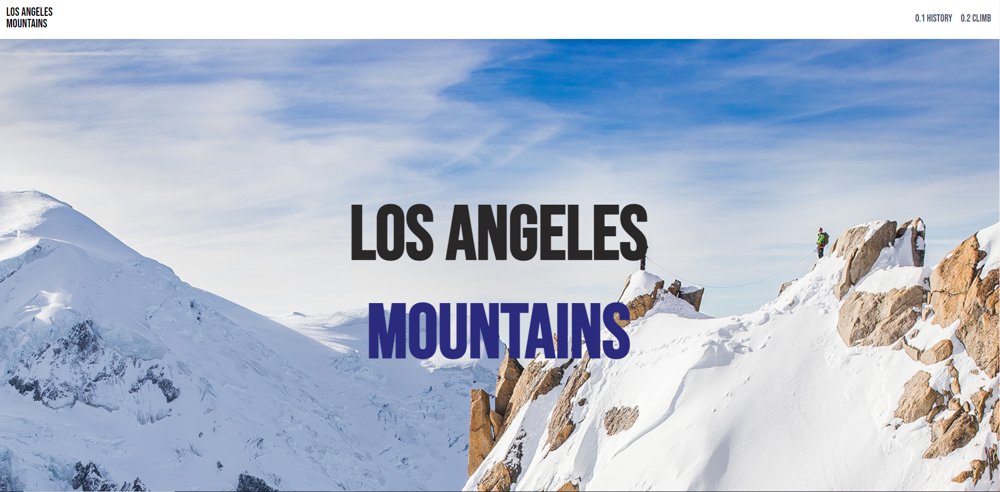
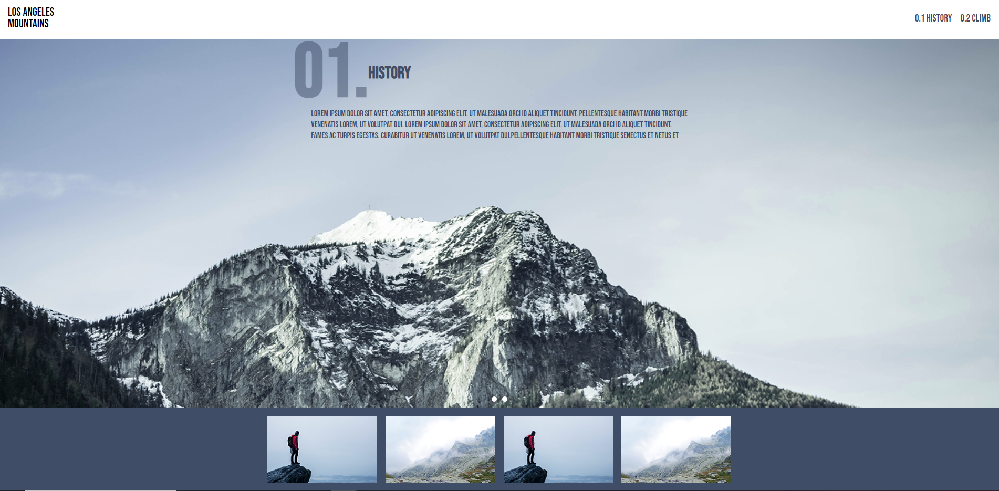
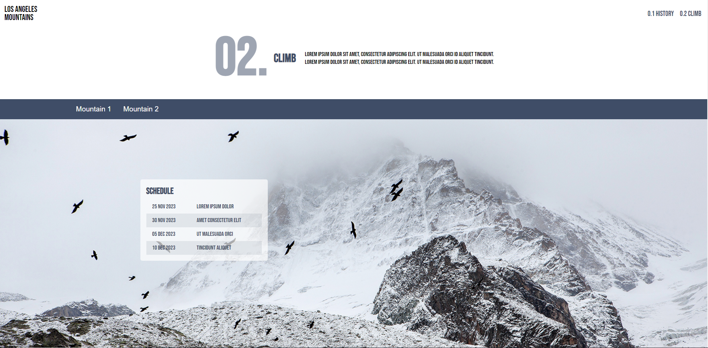

# Los Angeles Mountains

This project is a website showcasing the beauty of the mountains in Los Angeles. It provides users with the history of the area and information about climbing the mountains. You can view the live website [here](https://chrisalexrods.github.io/CoalitionTest1/).

## Table of Contents

1. [Features](#features)
2. [Installation](#installation)
3. [Usage](#usage)
4. [Screenshots](#screenshots)

## Features

- Interactive navigation
- Image carousel
- Climbing schedule
- Responsive design

## Installation

To set up the project on your local machine, follow these steps:

1. Clone the repository:

- git clone https://github.com/chrisalexrods/CoalitionTest1.git

2. Change directory to the cloned repository:

- cd CoalitionTest1

3. Open the `index.html` file in your preferred web browser.

## Usage

Browse the website to learn about the history of Los Angeles mountains, view stunning images, and find information about climbing the mountains.

## Screenshots

